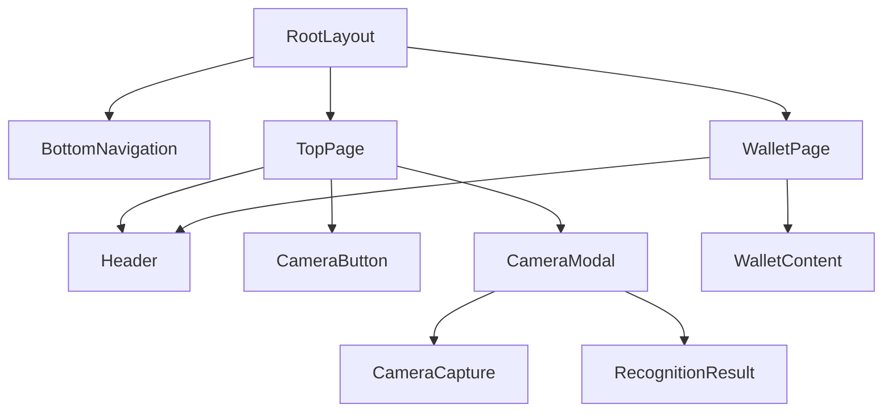

# Design Document: Top Page

## Overview

トップページは「ナンバープレート連動ウォレットシステム」のメインエントリーポイントとして、ユーザーがアプリの主要機能にアクセスするためのハブとなる。Apple-styleのミニマルなデザインを採用し、モバイルファーストのPWA対応を実現する。

### 設計方針

1. **シンプルさ**: 必要最小限の要素で直感的なUI
2. **一貫性**: 既存コンポーネント（CameraCapture, RecognitionResult）との統合
3. **アクセシビリティ**: WCAG AA基準準拠
4. **パフォーマンス**: 高速な初期表示とスムーズなインタラクション

## Architecture

### ページ構成

```
pkgs/frontend/
├── app/
│   ├── page.tsx              # トップページ（更新）
│   ├── wallet/
│   │   └── page.tsx          # ウォレットページ（新規）
│   └── layout.tsx            # レイアウト（更新）
├── components/
│   ├── layout/
│   │   ├── BottomNavigation.tsx  # ボトムナビゲーション（新規）
│   │   └── Header.tsx            # ヘッダー（新規）
│   ├── home/
│   │   ├── CameraButton.tsx      # カメラ起動ボタン（新規）
│   │   └── CameraModal.tsx       # カメラモーダル（新規）
│   └── license-plate/
│       ├── CameraCapture.tsx     # 既存
│       └── RecognitionResult.tsx # 既存
```

### コンポーネント階層



## Components and Interfaces

### 1. BottomNavigation

画面下部に固定表示されるナビゲーションバー。

```typescript
interface BottomNavigationProps {
  className?: string;
}

interface NavItem {
  href: string;
  label: string;
  icon: React.ReactNode;
}
```

**実装詳細:**
- `usePathname()`でアクティブ状態を判定
- Lucide Reactアイコンを使用
- 高さ: 64px（モバイルで親指が届きやすい）
- z-index: 50（他の要素より前面）

### 2. Header

ページ上部のヘッダーコンポーネント。

```typescript
interface HeaderProps {
  title?: string;
  showBackButton?: boolean;
  className?: string;
}
```

**実装詳細:**
- アプリタイトル/ロゴ表示
- オプションで戻るボタン
- 高さ: 56px

### 3. CameraButton

カメラ起動用の大きなボタン。

```typescript
interface CameraButtonProps {
  onClick: () => void;
  disabled?: boolean;
  className?: string;
}
```

**実装詳細:**
- 円形のボタン（直径: 120px）
- カメラアイコン + テキストラベル
- ホバー/アクティブ状態のアニメーション
- aria-label: "カメラを起動してナンバープレートを撮影"

### 4. CameraModal

カメラキャプチャ機能を表示するモーダル。

```typescript
interface CameraModalProps {
  isOpen: boolean;
  onClose: () => void;
  onRecognitionComplete?: (result: LicensePlateData) => void;
}
```

**実装詳細:**
- フルスクリーンモーダル
- 既存のCameraCaptureコンポーネントを統合
- 認識結果表示後に閉じるオプション
- ESCキーで閉じる対応

### 5. WalletContent

ウォレットページのダミーコンテンツ。

```typescript
interface WalletContentProps {
  className?: string;
}
```

**実装詳細:**
- 残高プレースホルダー: "¥0.00"
- 取引履歴プレースホルダー: 空のリスト
- "Coming Soon"バッジ

## Data Models

### ナビゲーション状態

```typescript
interface NavigationState {
  currentPath: string;
  previousPath: string | null;
}
```

### モーダル状態

```typescript
interface ModalState {
  isOpen: boolean;
  recognitionResult: LicensePlateData | null;
  error: RecognitionError | null;
}
```

### ウォレット表示データ（ダミー）

```typescript
interface WalletDisplayData {
  balance: string;
  currency: string;
  transactions: Transaction[];
  isLoading: boolean;
}

interface Transaction {
  id: string;
  type: 'send' | 'receive';
  amount: string;
  timestamp: number;
  description: string;
}
```

## Correctness Properties

*A property is a characteristic or behavior that should hold true across all valid executions of a system-essentially, a formal statement about what the system should do. Properties serve as the bridge between human-readable specifications and machine-verifiable correctness guarantees.*

### Property 1: Modal toggle state consistency

*For any* sequence of camera button clicks and modal close actions, the modal visibility state should always be consistent with the last action performed. If the last action was a button click, the modal should be open; if the last action was a close, the modal should be closed.

**Validates: Requirements 2.1, 2.4**

### Property 2: Capture triggers result display

*For any* valid captured image that triggers the onCapture callback, the CameraModal should transition to displaying the RecognitionResult component with the captured data.

**Validates: Requirements 2.3**

### Property 3: Navigation active state reflects current path

*For any* navigation item in the BottomNavigation, the item should have an active visual state if and only if the current pathname matches the item's href.

**Validates: Requirements 3.3, 5.4**

### Property 4: Navigation items navigate to correct paths

*For any* navigation item in the BottomNavigation, clicking the item should trigger navigation to the path specified in its href attribute.

**Validates: Requirements 5.3**

### Property 5: Interactive elements are accessible

*For any* interactive element (button, link) in the Top_Page and Wallet_Page, the element should have appropriate aria attributes and be focusable via keyboard navigation.

**Validates: Requirements 7.1, 7.2**

## Error Handling

### カメラエラー

既存のCameraCaptureコンポーネントのエラーハンドリングを活用:

1. **PERMISSION_DENIED**: カメラ権限が拒否された場合
   - モーダル内に権限要求メッセージを表示
   - 再試行ボタンを提供

2. **DEVICE_NOT_FOUND**: カメラデバイスが見つからない場合
   - エラーメッセージと代替手段を表示

3. **CAPTURE_FAILED**: キャプチャに失敗した場合
   - 再試行を促すメッセージを表示

### 認識エラー

既存のRecognitionResultコンポーネントのエラー表示を活用:

1. **NO_PLATE_DETECTED**: ナンバープレートが検出されない
2. **PARTIAL_RECOGNITION**: 部分的な認識のみ成功
3. **API_CONNECTION_FAILED**: API接続失敗
4. **TIMEOUT**: タイムアウト

### ナビゲーションエラー

1. **404エラー**: 存在しないページへのアクセス
   - Next.jsのnot-found.tsxで処理

## Testing Strategy

### Unit Tests

以下の具体的なケースをユニットテストでカバー:

1. **コンポーネントレンダリング**
   - TopPageが正しくレンダリングされる
   - WalletPageが正しくレンダリングされる
   - BottomNavigationが2つのナビゲーション項目を含む
   - Headerがタイトルを表示する

2. **アクセシビリティ**
   - CameraButtonにaria-labelが設定されている
   - ナビゲーションリンクがキーボードフォーカス可能

3. **PWA設定**
   - manifest.jsonに必要なフィールドが存在する

### Property-Based Tests

Property-based testingライブラリ: **fast-check**

各プロパティテストは最低100回のイテレーションで実行。

1. **Property 1: Modal toggle state consistency**
   - ランダムなopen/close操作シーケンスを生成
   - 最終状態が最後の操作と一致することを検証

2. **Property 2: Capture triggers result display**
   - ランダムなCapturedImageデータを生成
   - onCaptureコールバック後にRecognitionResultが表示されることを検証

3. **Property 3: Navigation active state reflects current path**
   - ランダムなパス名を生成
   - 対応するナビゲーション項目のみがアクティブ状態であることを検証

4. **Property 4: Navigation items navigate to correct paths**
   - 各ナビゲーション項目をクリック
   - 正しいパスへのナビゲーションが発生することを検証

5. **Property 5: Interactive elements are accessible**
   - すべてのインタラクティブ要素を列挙
   - 各要素がaria属性を持ち、フォーカス可能であることを検証

### Integration Tests

1. **カメラモーダルフロー**
   - ボタンクリック → モーダル表示 → キャプチャ → 結果表示 → 閉じる

2. **ナビゲーションフロー**
   - トップページ → ウォレットページ → トップページ

### テスト設定

```typescript
// vitest.config.ts
export default defineConfig({
  test: {
    environment: 'jsdom',
    setupFiles: ['./vitest.setup.ts'],
    coverage: {
      provider: 'v8',
      reporter: ['text', 'json', 'html'],
    },
  },
});
```

